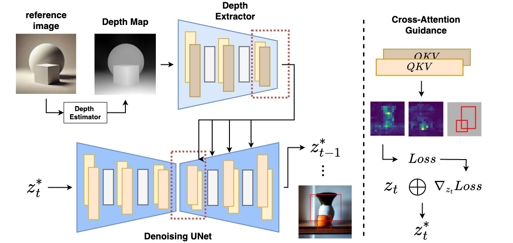
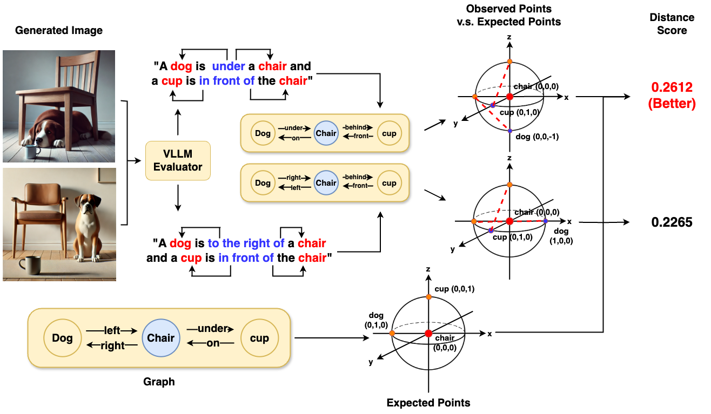

# SmartSpatial: Enhancing the 3D Spatial Arrangement Capabilities of Stable Diffusion Models and Introducing a Novel 3D Spatial Evaluation Framework
[](https://arxiv.org/abs/2501.01998)

## Overview
This is the implementation code for SmartSpatial.

SmartSpatial is a novel framework that enhances 3D spatial arrangement capabilities in Stable Diffusion models. It introduces:

1. SmartSpatial: A method that improves object placement precision in text-to-image generation by incorporating 3D-aware conditioning and cross-attention mechanisms.
   
2. SmartSpatialEval: A novel evaluation framework leveraging vision-language models and graph-based spatial analysis to assess generated images.

## Structure of SmartSpatial:
<p align="center">  </p>

## Structure of SmartSpatialEval:
<p align="center">  </p> 

Below are some example outputs:
<p align="center">  </p>

# Installation
To set up the environment, install the required dependencies using:
```bash
pip install -r requirements.txt
```

# Reproduction & Evaluation
## Configuration
Modify parameters in conf/base_config.yaml according to your needs. This includes:
1. Random seed for reproducibility
2. API key for external services (e.g., OpenAI)
3. Loss thresholds and hyperparameters

## Evaluation
To reproduce the result, you can refer to the script in script/benchmarks to generate images using different benchmarks. 

For evaluating the results, you can run the script in script/evaluation. In the folder, eval_trad.sh is for traditional metrics and eval_smart_spatial_eval is evaluating images via SmartSpatialEval.

# Inference
For SmartSpatial, each modules are in my_model folder.
To use SmartSpatial for spatially-aware text-to-image generation and instantiate the pipeline, you can refer to our pipeline code in SmartSpatial fodler.
For inference with SmartSpatial, you can simply create a SmartSpatialPipeline object like this:
```python
smart_spatial = SmartSpatialPipeline(conf, device)
```

Afterwards, run the "generate" function using this object and place in proper parameters. You can create your own reference images using matplotlib or Blender and convert them to depth map via our depth estimator code -- "preprocess_depth_map" function in SmartSpatialPipeline class.

For SmartSpatialEval, after placing you openai api key in conf/base_config.yaml, you can create SmartSpatialEval pipeline like this: 
```python
smart_spatial_eval = SmartSpatialEvalPipeline(conf, device)
```

and execute the "evaluate" function with proper parameters to evaluate your own dataset using SmartSpatialEval. Note that the data format should follow our dataset format. You can find the example format in "dataset>spatial_prompt.py".